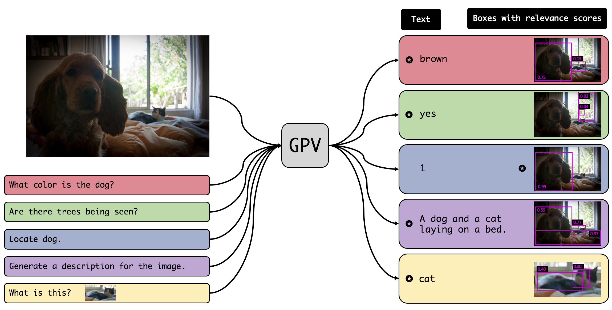

# Towards General Purpose Vision Systems
By [Tanmay Gupta](http://tanmaygupta.info/), [Amita Kamath](https://nlp.stanford.edu/~kamatha/), [Aniruddha Kembhavi](https://anikem.github.io/), and [Derek Hoiem](https://dhoiem.cs.illinois.edu/)



# Overview
Welcome to the official code base for GPV-I - a general purpose vision-language architecture that can learn and perform any task that requires bounding boxes or text prediction. We demonstrate the effectiveness of GPV-I by jointly training it on VQA, Captioning, Localization, and Classification tasks and achieveing favorable performance in comparison to specialized single-task models.

**Available on Arxiv**: [https://arxiv.org/abs/2104.00743](https://arxiv.org/abs/2104.00743)

**Project Page**: [https://prior.allenai.org/projects/gpv](https://prior.allenai.org/projects/gpv)

**Demo**: [https://vision-explorer.allenai.org/general_purpose_vision](https://vision-explorer.allenai.org/general_purpose_vision)

**BibTex**:
```
@article{Gupta2021GPV,
  title={Towards General Purpose Vision Systems},
  author={Tanmay Gupta and A. Kamath and Aniruddha Kembhavi and Derek Hoiem},
  journal={ArXiv},
  year={2021},
  volume={abs/2104.00743}
}
```

# Clone repository
```
git clone --recurse-submodules git@github.com:allenai/gpv.git
```

# Install dependencies
Create conda environment
```bash
conda create -n gpv python=3.6 -y
conda activate gpv
```

Install libraries
```bash
bash setup_conda_env.sh
```

# Paths
Decide the following paths:
- `<data_dir>`: This is the directory where images and annotations will be saved
- `<output_dir>`: This is where outputs of various experiments will be saved including model checkpoints, visualization, inference and evaluation results

`<data_dir>` and `<output_dir>` refer to these absolute paths in the instructions below. 

# Download data
To study generalization of concepts across skills, we created a new split of COCO annotations - COCO-SCE. To download the original and our new split, pretrained DETR checkpoints on both splits run the following:
```bash
bash setup_data.sh <data_dir>
```

# Download model
| Model | Split | Download |
|-------|-------|------|
| GPV | COCO | [Link](https://ai2-prior-gpv.s3-us-west-2.amazonaws.com/public/trained_models/gpv_all_original_split/ckpts/model.pth) |
| GPV | COCO-SCE | [Link](https://ai2-prior-gpv.s3-us-west-2.amazonaws.com/public/trained_models/gpv_all_gpv_split/ckpts/model.pth) |

To use any of these models, download them into `<output_dir>/<exp_name>/ckpts` directory as follows:
```
wget <link> -P <output_dir>/<exp_name>/ckpts/
```
`<exp_name>` could be any directory name of your choice such as `gpv_coco` or `gpv_coco_sce`.

# Test the model interactively
We provide easy to use interactive IPython notebooks where you may provide an image and a natural language task description and visualize the models outputs, namely - bounding boxes for relevant image regions and text answer. Note that while some tasks might expect only one of the output modalities, the model always outputs both. For example, the model outputs relevant regions during captioning and text during localization. These auxiliary outputs may be unsolicited but often provide useful and diagnostic information.

We provide the following notebooks:
- [inference.ipynb](inference.ipynb): This demonstrates inference for GPV-1 using greedy inference for text decoding as used in all experiments in our paper. 
- [inference_beam_search.ipynb](inference_beam_search.ipynb): Post-submission, we implemented beam search! This also allows greedy inference by setting beam size to 1. This also allows sampling multiple high ranking text outputs which is especially useful for tasks with multiple plausible outputs such as captioning.

We also provide equivalent `.py` scripts to run inference on a single image and task description pair. To run these scripts update `output_dir`, `ckpt`, `inputs.img`, and `inputs.query` in [configs/exp/gpv_inference_cmdline.yaml](configs/exp/gpv_inference_cmdline.yaml).

For inference with beam search run:
```
python -m inference_beam_search beam_size=5
```
For greedy decoding either set beam_size to 1 in the previous command or run the following:
```
python -m inference
``` 

# Train model
We provide scripts for training GPV on one or more of the following tasks: 
- `CocoClassification`
- `CocoVqa`
- `CocoDetection` (refered to as the Localization task in the paper)
- `CocoCaptioning`

Training GPV-1 involves 3 steps:
- **Step 1:** Update the [configs/exp/gpv.yaml](configs/exp/gpv.yaml) file. Here are the key parameters to consider (the ones marked with a star will be set later in Step 3):
    - `num_gpus_per_node` (set to 4 if you have 24GB GPUs, 2 for 48GB, and 1 for 80GB)
    - `dist_url`
    - `output_dir` *
    - `data_dir` *
    - `model.pretr_detr` *
- **Step 2:** Decide the dataset or combination of supported datasets to train the model. This is specified through one of the files in [configs/learning_datasets](configs/learning_datasets). For instance, `all.yaml` trains on all 4 tasks, `cap_vqa.yaml` trains on `CocoCaptioning` & `CocoVqa`, and `cap.yaml` trains only on `CocoCaptioning`. If you don't see a dataset combination you may add one by modifying `all.yaml`. We refer to the name of the chosen yaml file without the extension by `<learning_datasets>`
- **Step 3:** Launch training as follows:
    ```
    bash exp/gpv/scripts/train.sh <learning_datasets> <data_split> <exp_name> <output_dir> <data_dir>
    ```
    Note that training comprises of 2 sub-steps. First, the model is trained for `training.frozen_epochs` (in `configs/exp/gpv.yaml`) steps with DETR weights frozen. Then the model is finetuned end-to-end for a total of `training.num_epochs` epochs. `train_gpv.sh` executes both steps sequentially. `model.pretr_detr` is selected automatically in [train.sh](exp/gpv/scripts/train.sh) based on `<data_split>`.

- **Step 4:** Visualize loss, metrics, and learning rate on tensorboard:
    ```
    tensorboard --logdir=<output_dir> --bind_all
    ```

- **Step 5:** Predictions are visualized on a small set of train and validation set samples every few thousand iterations (`training.vis_step`). These are available at `<output_dir>/<exp_name>/training_visualizations`

# Evaluation
We provide evaluation code for the following tasks:
- `CocoClassification`
- `CocoVqa`
- `CocoDetection` (refered to as the Localization task in the paper)
- `CocoCaptioning` 
- `RefCocop` 

Run the following command to evaluate on one or a set of tasks
```
bash exp/gpv/scripts/eval.sh <exp_name> <task_name> <subset> <split> <output_dir> <data_dir>
```
- `<exp_name>`: name of the experiment directory (`<output_dir>/<exp_name>`) where the model to be evaluated lives.
- `<task_name>`: set to `all` to evaluate on all 5 tasks, `all_but_refexp` to evalute on all tasks excepts RefCocop, or the name of tasks to evaluate only on that task.
- `<subset>`: set to `train` or `val` for COCO (no `test` since COCO test annotations are hidden) and `train`, `val`, or `test` for COCO-SCE.
- `<split>`: set to `original_split` (COCO) or `gpv_split` (COCO-SCE). This flag is unused for `RefCocop`.

Predictions are saved at `<output_dir>/<exp_name>/eval`.